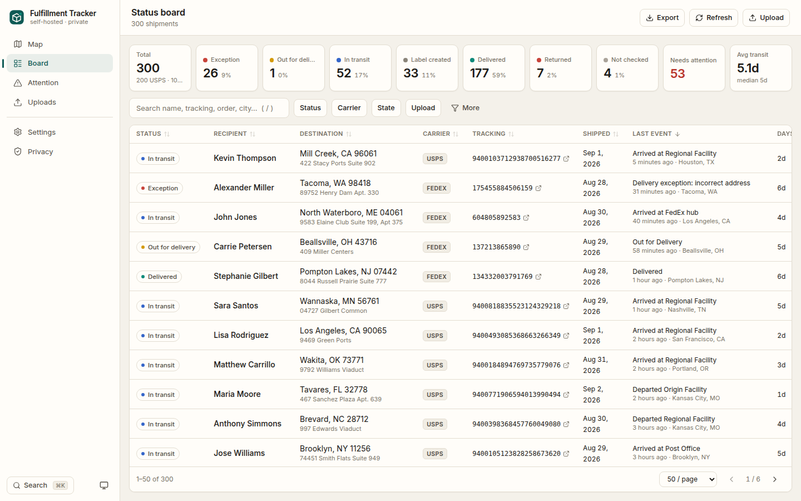
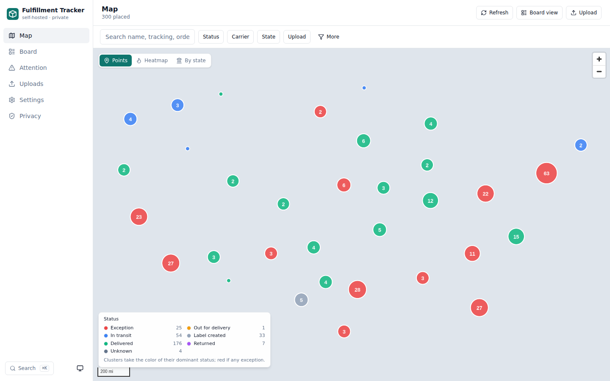
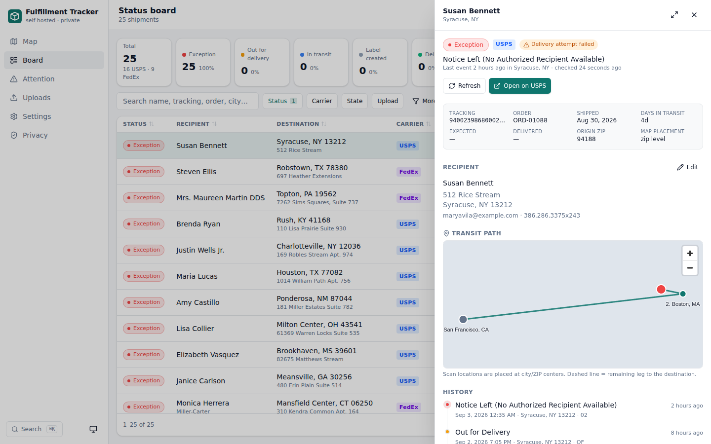
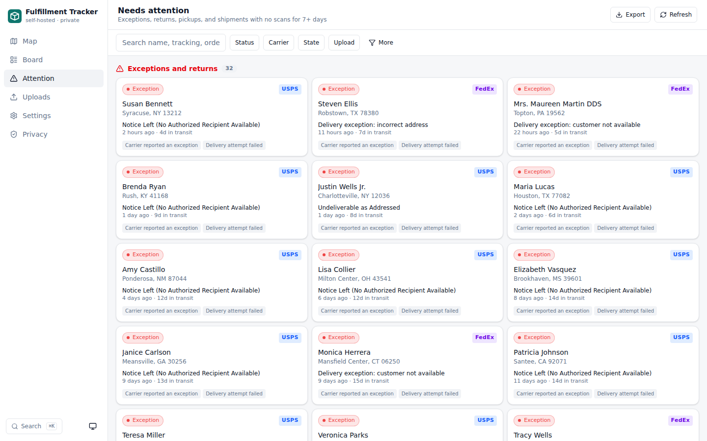
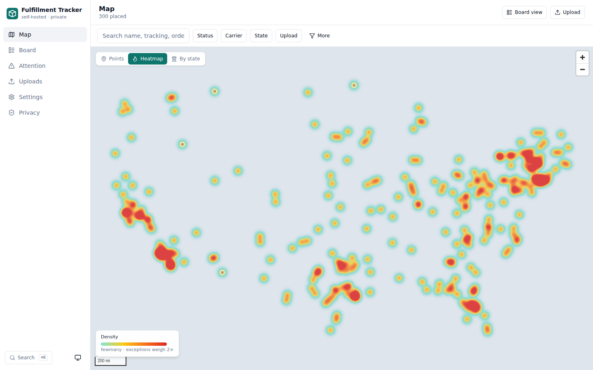
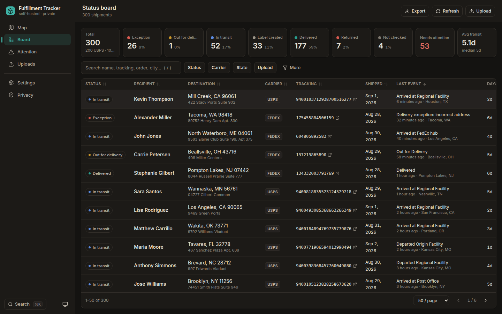
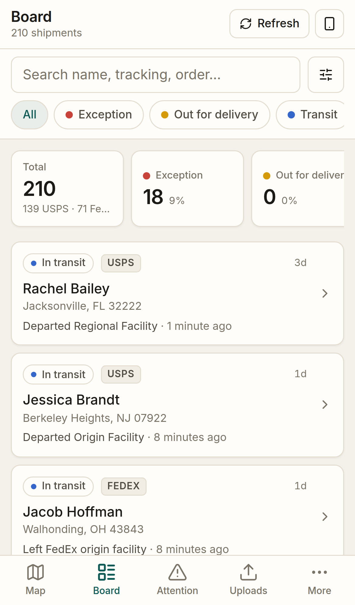
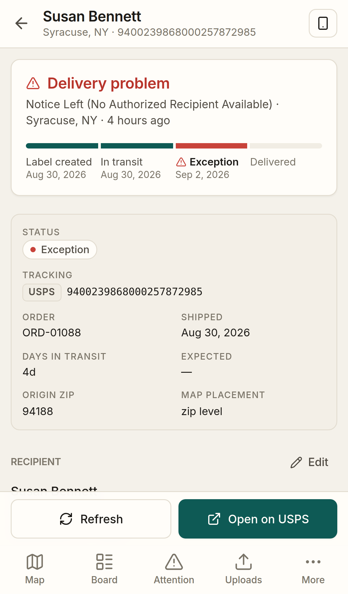
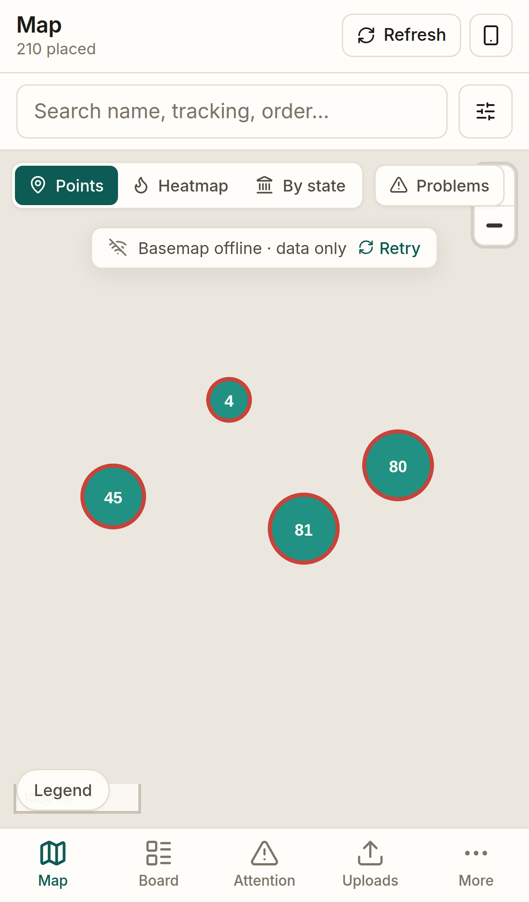

# Fulfillment Tracker

A self-hosted dashboard for keeping an eye on shipments. Upload spreadsheets of recipients (name, address, tracking
number), then see everyone on a map, work a status board you can filter and sort any way you like, and open any
shipment to see its transit path, event history and a link to the carrier's tracking page.

**Private by design.** Everything runs on your machine. Names and addresses never leave it. Only tracking numbers are
sent, straight to USPS or FedEx, and only when you click Refresh.



| Map | Shipment | Attention |
|---|---|---|
|  |  |  |
|  |  | |

| Phone: board | Phone: shipment | Phone: map |
|---|---|---|
|  |  |  |

## Quick start (Docker)

```bash
git clone <this repo> fulfillment-tracker && cd fulfillment-tracker
cp .env.example .env
docker compose up
```

Open **http://localhost:8000**. The app starts in **mock mode**: tracking data is generated locally so you can try
every screen without any carrier account. Data is stored in `./data` (SQLite + your uploaded files).

To see it with sample data, run in another terminal:

```bash
make seed demo      # needs Python 3.11 + uv; or upload the files in ./demo through the UI
```

## Quick start (without Docker)

Requires Python 3.11+ with [uv](https://docs.astral.sh/uv/) and Node 22 with pnpm.

```bash
cd backend && uv sync && cd ..
cd frontend && pnpm install && cd ..
make dev            # backend on http://localhost:8000, Vite dev server on http://localhost:5173
```

Open http://localhost:5173 during development (it proxies `/api` to the backend). For a production-style run, build
the frontend once (`make build`) and use http://localhost:8000 directly.

## What you get

| Screen | What it does |
|---|---|
| **Map** | Every recipient on a zoomable map. Three views: status-colored **clusters/points**, a **heatmap** (exceptions weigh double), and a **by-state** choropleth. Hover for details, click a point to open the shipment, click a state to filter. |
| **Board** | Sortable, filterable table with stat tiles by status. Filter by status, carrier, state, upload, tag, city, ship date, last-event date, days in transit, or free-text search. Choose columns, paginate, export the current view to CSV/XLSX. |
| **Attention** | Exceptions, returns, packages waiting for pickup, tracking errors, shipments with no scans for N days, and addresses that could not be placed on the map, grouped by reason. |
| **Shipment detail** | Status, key facts, editable recipient, transit-path map (origin → scans → destination), full event timeline, notes, tags, one-click refresh, and "Open on USPS/FedEx". |
| **Uploads** | Every spreadsheet you imported with new / merged / skipped counts. Delete an upload to remove shipments that came only from it. |
| **Settings** | Carrier credentials (mock or live, sandbox toggle, test button), geocoder choice, stuck-days rule, basemap URL, theme. |
| **Privacy** | Exactly what leaves the machine, where data lives, where secrets are stored, an outbound-request log, and a wipe-everything button. |

Keyboard: `⌘/Ctrl+K` opens the command palette (search shipments, jump to pages), `/` focuses search, `Esc` closes
the drawer.

## Using it from your phone

Every main screen has a **Send to phone** / copy-link button. It copies a link to exactly what you are looking at
(a shipment, a filtered board, a map view). Where the link points depends on what you have set up, best first:

| You have | The link opens |
|---|---|
| `PUBLIC_URL` set (a Cloudflare Tunnel or any HTTPS address for your server) | the hosted UI at `HOSTED_UI_URL` with `?server=<your server>` so it connects with one tap, from anywhere |
| only the default install | `http://<your LAN IP>:8000/...`, which works on the same Wi-Fi |

If `APP_PASSWORD` is set, the phone asks for it once and remembers it in that browser. Below 768px the app switches to
a phone layout: bottom tabs, a card list with a filter sheet, a full-screen shipment page with a sticky carrier
button, and a full-bleed map with a bottom sheet.

### Hosting the UI on Cloudflare Pages (no data leaves your machine)

The frontend can be served from Cloudflare Pages as a pure static site. It holds **no data**: on first open it asks for
your server's address (or gets it from a handoff link) and talks to your self-hosted backend directly from the browser.
The backend only needs to allow that origin (`ALLOWED_ORIGINS`, preset for `fufillment-tracker.pages.dev`).

Auto-deploy is wired up in `.github/workflows/deploy-pages.yml`. To turn it on:

1. In Cloudflare, create an API token with the **Cloudflare Pages: Edit** permission and note your **Account ID**.
2. In GitHub: **Settings → Secrets and variables → Actions**, add `CLOUDFLARE_API_TOKEN` and `CLOUDFLARE_ACCOUNT_ID`.
3. Push (or run the workflow manually). The first run creates a Pages project named after the repository
   (`fufillment-tracker`) and every later push to `main`/`master`/the feature branch redeploys.

Your UI is then at `https://fufillment-tracker.pages.dev`. Browsers block an `https://` page from calling an
`http://` LAN address, so for the hosted UI to reach your server it needs an HTTPS address:

**Cloudflare Tunnel (recommended, free):**

```bash
cloudflared tunnel login
cloudflared tunnel create tracker
cloudflared tunnel route dns tracker tracker.example.com      # any hostname on a domain you have in Cloudflare
cloudflared tunnel run --url http://localhost:8000 tracker
```

Then set in `.env`: `PUBLIC_URL=https://tracker.example.com` and `APP_PASSWORD=...` (or protect the hostname with
Cloudflare Access). Restart, click **Send to phone**, and the link opens the hosted UI already connected to your
server. Only you decide who reaches the tunnel; the data still lives on your machine.

## Uploading spreadsheets

Drop an `.xlsx`, `.xls`, `.ods`, `.csv` or `.tsv`. The importer:

- finds the header row even when there is a title row above it;
- auto-detects columns (name, address, city, state, ZIP, tracking number, carrier, order, ship date, email, phone, and
  combined "City, ST ZIP" columns) and lets you confirm or fix the mapping before anything is saved;
- remembers mappings as presets and applies them automatically to files with the same headers;
- detects the carrier from the tracking-number format (USPS 22-digit IMpb with check digit, 13-character international,
  FedEx 12/15/20/22-digit) and asks for a default when a number is ambiguous. A **Carrier** column in your sheet always
  wins, so include one if you can;
- merges duplicate tracking numbers across uploads instead of creating duplicates, filling in blanks from the new file;
- places every shipment on the map by ZIP code, offline.

Only a tracking-number column is required. Without a ZIP or city/state, shipments import but do not appear on the map.

## Tracking status

Nothing is polled automatically. Click **Refresh** on the Map, Board or Attention page to fetch the latest status for
active shipments (delivered and returned ones are skipped unless you tick "include delivered"). Progress shows in the
button; the page updates when the job finishes. Each shipment also has its own Refresh button.

Statuses are normalized to: label created, in transit, out for delivery, delivered, exception, returned, unknown.
Carrier-specific wording (e.g. USPS "Available for Pickup") is kept as the raw status and surfaced on the Attention page.

### Connecting USPS

1. Create a free account at https://developers.usps.com and add an app. In the app, add the **Tracking** API product.
2. Copy the app's **Consumer Key** and **Consumer Secret**.
3. In the app: **Settings → Carriers → USPS**, switch to **Live**, paste the key and secret, tick **test environment**
   if your app is not yet approved for production, **Save**, then **Test credentials**.

The USPS test environment (`apis-tem.usps.com`) returns canned data. Production access to the Tracking product can take
a few business days to be approved.

### Connecting FedEx

1. Create a free account at https://developer.fedex.com and create a project that includes the **Track API**.
2. Copy the **API Key** and **Secret Key** (test or production).
3. In the app: **Settings → Carriers → FedEx**, switch to **Live**, paste the keys, tick **sandbox** for test keys,
   **Save**, then **Test credentials**.

The FedEx sandbox only returns results for FedEx's published test tracking numbers.

Credentials can also be supplied through environment variables (`USPS_CLIENT_ID`, `USPS_CLIENT_SECRET`,
`FEDEX_API_KEY`, `FEDEX_SECRET_KEY`); they then override the Settings page and show as read-only.

## Geocoding

- **Offline (default, always on):** each shipment is placed at the center of its ZIP code using a bundled US ZIP
  database. Nothing leaves the machine. Missing ZIPs fall back to the city or state center. Scan locations in transit
  paths are placed the same way.
- **Street-level (opt-in per upload):** choose it in the upload wizard to send street addresses to a geocoder you
  configure in **Settings → Geocoding**: OpenStreetMap Nominatim (free, needs a contact email), Geocodio (API key) or
  Mapbox (token). Results are cached so each address is sent once. Runs as a background job after the import.

## Privacy and security

- The only outbound requests the server makes are to the carrier APIs (tracking numbers only), the optional geocoder
  (addresses, only when you opt in), and nothing else. The browser additionally fetches map tiles from the basemap host,
  which reveals only the area you are viewing. The **Privacy** page lists every host contacted and how often.
- No analytics, telemetry, update checks, CDN scripts or web fonts. A Content-Security-Policy header enforces the
  allowed hosts.
- Carrier secrets and geocoder keys are encrypted at rest with a key from `APP_SECRET_KEY` or an auto-generated
  `data/.secret_key` (mode 600). Back up that file with the database if you want to keep saved credentials.
- Set `APP_PASSWORD` in `.env` to require a password (HTTP Basic, any username) when you expose the app on your LAN.
  Put it behind HTTPS (Caddy, Tailscale, etc.) if it leaves your machine.
- Uploaded spreadsheets are kept in `data/uploads/` so an upload can be inspected or re-parsed; they are deleted with the
  upload or with **Wipe all data**.

## The map basemap

The map uses OpenFreeMap's free public vector tiles: the quiet **Positron** style in light mode and **Fiord** in dark
mode. Nothing needs to be configured; tile requests only reveal the area you are looking at. You can point either
theme at any MapLibre style URL under **Settings → General** or with `MAP_STYLE_URL` / `MAP_STYLE_URL_DARK`.

**If the map is grey with a "Basemap unavailable" banner:** the browser could not reach the tile host. Your shipments
still render on a blank background. Check the internet connection, a corporate proxy or ad blocker
(`tiles.openfreemap.org` must be allowed), then click Retry. The screenshots in this README were taken in a sandbox
without tile access, which is why they show the blank background.

### Fully offline maps (optional)

To run with no internet at all:

1. Download a PMTiles basemap for your region (for example from [Protomaps builds](https://maps.protomaps.com/builds/),
   a US extract is roughly 1–2 GB) into `data/tiles/basemap.pmtiles`.
2. Serve it locally with any static server that supports HTTP range requests (or `pmtiles serve`), and create a style
   JSON that points at it (Protomaps publishes ready-made styles).
3. Set `MAP_STYLE_URL` (and `MAP_STYLE_URL_DARK`) in `.env`, or **Settings → General → Basemap style URL**, to your
   style's URL.

## Configuration

All options live in `.env` (see `.env.example`):

| Variable | Default | Purpose |
|---|---|---|
| `DATA_DIR` | `./data` | Where the SQLite database, uploads and secret key live |
| `CARRIER_MODE` | `mock` | `mock` generates fake tracking data; `live` uses real carrier APIs |
| `APP_PASSWORD` | unset | Require a password for the whole app |
| `APP_SECRET_KEY` | auto | Key used to encrypt stored secrets |
| `USPS_CLIENT_ID` / `USPS_CLIENT_SECRET` | unset | USPS credentials via env (override Settings) |
| `FEDEX_API_KEY` / `FEDEX_SECRET_KEY` | unset | FedEx credentials via env (override Settings) |
| `MAP_STYLE_URL` | OpenFreeMap positron | MapLibre style URL for the light basemap |
| `MAP_STYLE_URL_DARK` | OpenFreeMap fiord | MapLibre style URL for the dark basemap |
| `PUBLIC_URL` | unset | HTTPS address of this server from outside the LAN (tunnel), used by Send to phone |
| `HOSTED_UI_URL` | `https://fufillment-tracker.pages.dev` | Where the hosted UI lives; handoff links open it |
| `ALLOWED_ORIGINS` | the Pages domain + localhost:5173 | Browser origins allowed to call the API |

## Development

```
backend/    FastAPI + SQLAlchemy + SQLite (uv, ruff, pytest)
frontend/   React 19 + TypeScript + Vite + Tailwind 4 + MapLibre GL (pnpm, vitest, playwright)
demo/       generated sample spreadsheets (fake data)
```

```bash
make dev             # run both with hot reload
make test            # pytest + vitest
make lint            # ruff + oxlint + tsc
make seed            # regenerate ./demo spreadsheets
make demo            # upload ./demo files to a running server and refresh with mock carriers
make gen-api         # regenerate frontend/src/api/schema.d.ts from the running backend's OpenAPI
make e2e             # Playwright smoke test (desktop + phone viewport) against a running server on :8000
pnpm build:hosted    # (in frontend/) build the Cloudflare Pages variant into dist-hosted/
make docker-build    # build the production image
```

API docs are served at http://localhost:8000/api/docs.

### Design notes

- **Visual system.** Warm paper surfaces, near-black ink, one deep blue-green accent, Inter (self-hosted). Every color
  is a token in `frontend/src/index.css`; components never use raw Tailwind colors. Status colors are validated for
  colorblind separation on the map (returned shares the exception hue and is drawn hollow; out-for-delivery gets an
  ink ring) and always appear with a label or icon elsewhere.
- **Progress stepper.** `frontend/src/components/shipment/ProgressStepper.tsx` derives the four-step progress
  (label → transit → out for delivery → delivered) from the shipment status and its events, with exceptions and
  returns shown as a red branch at the step where they happened.

- **Status mapping** lives in `backend/app/services/status_map.py` as plain tables, so adjusting how a carrier code maps
  to a normalized status is a one-line change with a parametrized test.
- **Carriers** implement a small protocol (`backend/app/carriers/base.py`): `fetch(numbers) -> {number: TrackResult |
  TrackError}`. The mock carrier is deterministic (hash of the tracking number) and advances with time, so demos and
  tests are stable.
- **Filters** are one shared SQLAlchemy builder (`backend/app/services/query.py`) used by the board, map, stats, export
  and attention endpoints, and they live in the URL on the frontend so views stay in sync and links are shareable.
- **Every outbound HTTP request** goes through `backend/app/http.py`, which records host + purpose + data class (never
  payloads) for the Privacy page.

## Assumptions

- US addresses (state and ZIP normalization assume US; other rows import without a map position).
- One sheet per upload (choose the sheet in the wizard).
- "Delivered to agent" counts as delivered; "available for pickup" counts as in transit and is flagged for attention.
- Notes are plain text.
